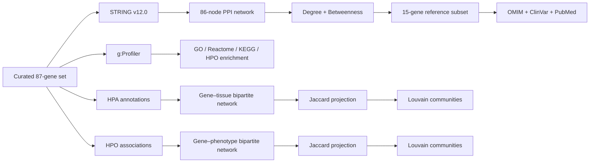

# Human Spliceosome Network Analysis in R

**Systems Biology · Network Bioinformatics · Functional Enrichment · Biomedical Data Integration**

> Portfolio version of the Master's Thesis **“Organización funcional y relevancia biomédica de los genes del espliceosoma humano: un enfoque de Biología de Sistemas”**.

This repository documents and preserves the computational work behind the thesis as a technical portfolio project. The study combines curated spliceosome gene sets, protein–protein interaction analysis, network topology, functional enrichment, tissue-expression associations, human phenotype associations and clinical evidence.

The repository is deliberately structured so that a researcher, bioinformatician or technical recruiter can move from **biological question → data → analysis → quantitative results → code → full thesis** without having to reconstruct the project from a collection of disconnected files.

> **Data provenance note:** numerical values, genes, thresholds and reported findings are taken from the supplied thesis/project material. No new biological result has been added to the portfolio presentation.

---

## Executive summary

The project starts from a manually curated set of **87 human spliceosome-related protein-coding genes**, classified into three functional groups: **39 structural-core genes, 20 auxiliary factors and 28 regulatory factors**.

The PPI network was generated in **STRING v12.0** for *Homo sapiens* using a combined confidence threshold of **≥ 0.700** and a zero-order network. `ISL1` remained in the complete gene set but had no interaction with the rest of the set at that threshold, leaving **86 connected genes** for the topological analysis.

The resulting PPI network contained **1,832 edges**, a mean interaction score of **0.784**, and a STRING PPI-enrichment result of **p < 1 × 10⁻¹⁶**, compared with 96 expected interactions for a random set of the same size.

The analysis then integrated functional enrichment, HPA tissue associations, HPO phenotype associations and clinical evidence from OMIM, ClinVar and PubMed. The most prominent topological distinction was between **direct connectivity** and **network intermediation**: `SF3A2` had the highest degree (69), whereas `SRSF1` had the highest betweenness (268.84).

---

## Results at a glance

| Analysis | Result |
|---|---|
| Curated spliceosome set | **87 genes** |
| Functional classification | **39 core · 20 auxiliary · 28 regulatory** |
| Connected PPI network | **86 nodes · 1,832 edges** |
| Mean STRING interaction score | **0.784** |
| STRING PPI enrichment | **p < 1 × 10⁻¹⁶** |
| Highest PPI degree | **SF3A2 — 69** |
| Highest PPI betweenness | **SRSF1 — 268.84** |
| Topological reference subset | **15 genes** |
| HPA global network | **76 genes · 346 tissues · 12,527 connections** |
| HPO global network | **27 genes · 516 phenotypes · 836 connections** |
| HPO Louvain communities | **14** |
| Similarity projection | **J ≥ 0.20 groups · J ≥ 0.25 global** |

The complete topological 15-gene subset is documented in the thesis and preserved in the repository. It includes `SF3A2`, `SRSF1`, `SNRPD2`, `SNRPF`, `SF3B1`, `SNRPD1`, `SNRNP70`, `U2AF2`, `SF3B2`, `PRPF19`, `PRPF8`, `HNRNPA1`, `CDC5L`, `DHX38` and `EFTUD2`.

---

## Visual results

The repository includes the network figures and quantitative plots generated or preserved during the project. Start with the visual gallery:

**[→ Open the results gallery](docs/portfolio/RESULTS_GALLERY.md)**

### Global PPI network


The thesis reports a STRING v12.0 network built from the 87-gene input set, with 86 connected nodes and 1,832 edges; `ISL1` remained isolated at the ≥0.700 confidence threshold.

### Global HPA tissue-similarity network

The global HPA analysis produced **12,527 gene–tissue bipartite connections between 76 genes and 346 tissues**. The corresponding Jaccard projection used **J ≥ 0.25** and Louvain community detection.


### Global HPO phenotype-similarity network

The global HPO analysis comprised **27 mapped genes, 516 phenotypes and 836 bipartite connections**, followed by Jaccard projection at **J ≥ 0.25** and Louvain community detection, yielding **14 communities**.


---

## Biological question

The thesis asks whether the human spliceosome can be characterized as an interconnected biological system in which genes occupy distinguishable topological, functional, tissue and clinical positions.

The computational strategy therefore does not focus on a single gene or disease. Instead, it integrates multiple views of the same gene set:

1. **Network topology:** which nodes are highly connected and which act as intermediaries?
2. **Functional organization:** which biological processes, cellular components and pathways are enriched?
3. **Tissue context:** where are the genes associated with the most connected HPA terms?
4. **Phenotypic context:** which human phenotypes are shared across genes?
5. **Clinical evidence:** which highly central genes have documented disease associations?

---

## Computational workflow



---

## Dataset and curation

The final study set contains **87 protein-coding genes**. The functional classes were manually assigned using Reactome, UniProt and the specialist literature, based on the predominant role of each encoded protein within the spliceosome or splicing regulation.

The three groups are:

- **Structural core:** 39 genes.
- **Auxiliary factors:** 20 genes.
- **Regulatory factors:** 28 genes.

The inclusion criteria required documented participation in the major spliceosome, predominantly nuclear localization, functional/experimental evidence for a direct role in splicing-related processes, and identification in at least two consulted molecular databases. Peripheral accessory proteins, indirect factors and exclusively cytoplasmic proteins were excluded.

The complete reference dataset is available in `data/reference/`.

---

## Network topology

The PPI network was created in **STRING v12.0** with *Homo sapiens*, combined confidence **≥ 0.700**, and a **zero-order network** restricted to the supplied protein set.

`ISL1` did not connect to the rest of the set at this threshold. It was retained in the study dataset and annexes but excluded from topological calculations, leaving **86 connected genes**.

Network topology was evaluated as an undirected network using **degree centrality** and **betweenness centrality**. A B/D (betweenness/degree) ratio was also calculated as a complementary measure of relative intermediation.

The top degree results were dominated by structural-core components. `SF3A2` ranked first with degree **69**, followed by `SRSF1` and `SNRPD2` at **66**.

Betweenness revealed a different pattern: `SRSF1` ranked first at **268.84**, followed by `SF3A2` at **163.48** and `U2AF2` at **109.04**. `DHX38` was the highest-ranked auxiliary factor in the reported top-10 list, with **55.39**.

---

## Functional enrichment

The enrichment analysis used **g:Profiler**, *Homo sapiens* as organism, and GO, Reactome, KEGG and HPO resources. Statistical significance was evaluated using the platform's **g:SCS multiple-testing correction**, with adjusted **p < 0.05** as the significance threshold.

At the global level, the most prominent biological-process terms included:

- `RNA splicing` — GO:0008380 — 82/86 — adjusted p = 9.08 × 10⁻⁷⁹
- `mRNA splicing, via spliceosome` — GO:0000398 — 80/86 — adjusted p = 2.86 × 10⁻⁷⁷
- `mRNA processing` — GO:0006397 — 81/86 — adjusted p = 1.36 × 10⁻⁷⁵
- `RNA processing` — GO:0006396 — 85/86 — adjusted p = 4.67 × 10⁻⁶⁴

---

## HPA tissue analysis

HPA terms exported from g:Profiler were transformed from the `intersections` field to long format and used to build bipartite gene–tissue networks.

The global network contained **76 genes**, **346 tissues** and **12,527 bipartite connections**. The highest-degree genes reported were `HNRNPK` and `HNRNPM` (305 each), `SRSF3` (298), `HNRNPA2B1` (285), `HNRNPU` (284) and `SNRNP70` (283).

---

## HPO phenotype analysis

Because HPO coverage available directly through the g:Profiler enrichment output was limited for some groups, the project also integrated the complete `genes_to_phenotype.txt` association resource after mapping gene symbols to NCBI Entrez identifiers with `org.Hs.eg.db`.

The global HPO network contained **27 mapped genes**, **516 phenotypes** and **836 bipartite connections**, with **14 Louvain communities** after Jaccard projection.

The highest-degree genes in the global phenotype network included `SF3B4` (82), `HNRNPK` (70), `HNRNPH1` (59), `SF3B2` (54) and `CRNKL1` (53).

---

## Clinical association analysis

For the 15 genes selected as the topological reference subset, the thesis integrated evidence from **OMIM**, **ClinVar** and a targeted **PubMed** literature search. The evidence was grouped into four categories: hereditary disease, cancer-related evidence, indirect functional evidence or no clear pathogenic association.

Examples reported in the thesis include established disease associations for `SF3B1`, `PRPF8` and `EFTUD2`, while `PRPF19`, `CDC5L` and `DHX38` were described as having less-defined monogenic disease associations but growing functional evidence in disease-relevant processes.

---

## Repository structure

```text
spliceosome-network-analysis-R/
│
├── README.md
├── NOTICE.md
├── .gitignore
│
├── data/
│   ├── reference/        # curated 87-gene dataset
│   ├── gprofiler/        # supplied g:Profiler intersection exports
│   └── hpo/              # HPO association data used by the workflow
│
├── scripts/
│   ├── analysis/         # principal R analysis workflow
│   ├── data/             # HPO acquisition helper
│   ├── reporting/        # report compilation scripts
│   └── legacy/           # document-assembly utilities retained for provenance
│
├── results/
│   ├── HPA/              # Excel outputs from tissue-network analysis
│   └── HPO/              # Excel outputs from phenotype-network analysis
│
├── figures/
│   ├── PPI/              # PPI figures preserved from thesis material
│   ├── HPA/              # tissue plots and networks
│   └── HPO/              # phenotype plots and networks
│
└── docs/
    ├── portfolio/        # recruiter-facing documentation
    ├── report/           # R Markdown + compiled analysis report
    └── tfm/              # complete Master's Thesis PDF
```

---

## Reproducibility

### Main script

The main workflow is:

```text
scripts/analysis/network_analysis.R
```

Run it from the repository root:

```bash
Rscript scripts/analysis/network_analysis.R
```

The script expects the supplied data files to remain in their repository-relative locations.

### What the R workflow reproduces

The supplied R workflow performs the HPA/HPO analysis pipeline, including Entrez mapping, phenotype/tissue association preparation, bipartite-network construction, centrality metrics, Jaccard projections, Louvain communities, Excel outputs and figures.

### Reproducibility boundary

The original PPI acquisition and NetworkAnalyst calculations are preserved as documented parts of the academic project. The supplied R script does **not** recreate the original STRING interaction retrieval through an API or rerun the NetworkAnalyst web calculation. The repository therefore distinguishes external platform outputs from analysis implemented in R.

The HPO acquisition helper points to the latest HPO release URL, while the repository preserves the project snapshot used for the supplied analysis. Re-running the downloader later may retrieve a newer release.

---

## Documentation

| File | Purpose |
|---|---|
| [`RESULTS_GALLERY.md`](docs/portfolio/RESULTS_GALLERY.md) | Visual overview of the main networks and quantitative plots |
| [`RESULTS_SUMMARY.md`](docs/portfolio/RESULTS_SUMMARY.md) | Compact quantitative result summary |
| [`PROJECT_OVERVIEW.md`](docs/portfolio/PROJECT_OVERVIEW.md) | Project context and workflow |
| [`REPRODUCIBILITY.md`](docs/portfolio/REPRODUCIBILITY.md) | Inputs, thresholds and reproducibility boundaries |
| [`REPOSITORY_PLAN.md`](docs/portfolio/REPOSITORY_PLAN.md) | Folder architecture and maintenance rules |
| [`TFM.pdf`](docs/tfm/TFM.pdf) | Complete Master's Thesis |
| [`network_analysis.R`](scripts/analysis/network_analysis.R) | Main R workflow |

---

## Interpretation boundaries

The network centrality results describe **topological position**, not biological causality. The thesis identifies database bias, dependence on the initial gene-selection criteria, the static representation of a dynamic spliceosome, and the absence of experimental validation as limitations.

Association with a phenotype, disease or network position should therefore not be read as proof that a gene is causally responsible for that pathology.

---

## Academic provenance

**Student:** Antonio José Bailén de la Cruz  
**Programme:** Master's in Biotechnology and Biomedicine  
**Department:** Biología Experimental  
**Date:** 02/07/2026

See [`NOTICE.md`](NOTICE.md) for provenance and reuse information.
