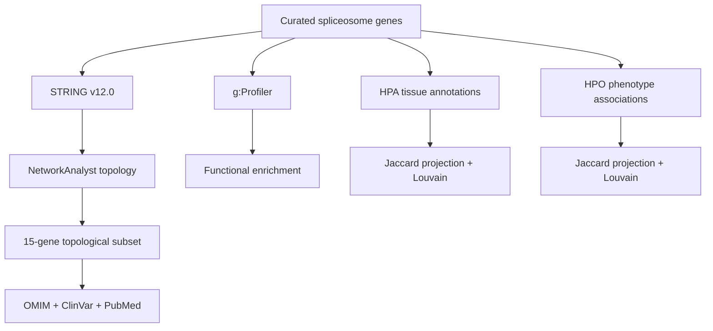

# Human Spliceosome Network Analysis in R

**Systems Biology portfolio project | Bioinformatics | Network analysis | Biomedical data integration**

> Master's Thesis project: **“Organización funcional y relevancia biomédica de los genes del espliceosoma humano: un enfoque de Biología de Sistemas”**

This repository presents the analysis behind my Master's Thesis as a reproducible, recruiter-friendly bioinformatics project. It brings together a curated human spliceosome gene set, protein–protein interaction network analysis, functional enrichment, tissue-expression networks and phenotype/clinical association analysis.

## At a glance

| | Project value |
|---|---|
| Study set | **87 genes** |
| Functional groups | **39 core · 20 auxiliary · 28 regulatory** |
| STRING PPI network | **86 connected nodes · 1,832 edges** |
| Mean interaction score | **0.784** |
| PPI enrichment | **p < 1 × 10^-16** |
| HPA global network | **76 genes · 346 tissues · 12,527 bipartite connections** |
| HPO global network | **27 genes · 516 phenotypes · 836 bipartite connections** |
| Community detection | **Louvain** |
| Similarity projection | **J ≥ 0.20 / J ≥ 0.25** |

All numerical values above are taken from the supplied Master's Thesis and project outputs; no external values have been added.

## What the project demonstrates

This project shows an end-to-end dry-lab workflow in which biological questions are translated into structured network analyses:

- gene-set curation and functional classification;
- STRING-based protein–protein interaction analysis;
- degree and betweenness centrality;
- functional sub-network comparison;
- g:Profiler enrichment using GO, Reactome, KEGG and HPO;
- gene–tissue and gene–phenotype bipartite networks;
- Entrez identifier mapping with `org.Hs.eg.db`;
- Jaccard similarity projections;
- Louvain community detection;
- automated Excel result tables and network figures in R;
- integration with OMIM, ClinVar and PubMed for biomedical interpretation.

## Biological scope

The final curated set contains **87 genes** classified into structural core, auxiliary and regulatory groups. `ISL1` was retained in the complete gene lists but had no STRING interaction with the rest of the set at the ≥0.700 confidence threshold, so the topological analysis used the remaining 86 connected genes.

The global PPI network contained **1,832 edges**, versus **96 expected interactions** for a random set of the same size according to STRING, with a reported **PPI enrichment p < 1 × 10^-16**.

The topology highlights a strong distinction between direct connectivity and network intermediation. `SF3A2` had the highest degree (69), while `SRSF1` had the highest betweenness (268.84). The thesis selected a 15-gene reference subset by combining high centrality with functional diversity.

## Research workflow



## Repository structure

```text
.
├── data/
│   ├── reference/      # 87-gene study dataset + readable TSV
│   ├── gprofiler/      # supplied g:Profiler intersections exports
│   └── hpo/            # supplied HPO association snapshots
├── scripts/
│   ├── analysis/       # main R analysis workflow
│   ├── data/           # HPO data retrieval helper
│   ├── reporting/      # report-generation scripts
│   └── legacy/         # document assembly utilities supplied with the project
├── results/
│   ├── HPA/            # tissue-network Excel outputs
│   └── HPO/            # phenotype-network Excel outputs
├── figures/
│   ├── HPA/            # tissue-network figures
│   └── HPO/            # phenotype-network figures
├── docs/
│   ├── portfolio/      # recruiter-facing summaries and reproducibility notes
│   ├── report/         # R Markdown source and project report materials
│   └── tfm/            # final Master's Thesis
├── NOTICE.md
└── README.md
```

## Reproducibility

The main R workflow is `scripts/analysis/network_analysis.R`. It performs the supplied HPA/HPO analysis workflow, including Entrez mapping, bipartite network construction, centrality metrics, Jaccard projections, Louvain communities, Excel outputs and figures.

Run it from the repository root:

```bash
Rscript scripts/analysis/network_analysis.R
```

The analytical workflow uses the supplied timestamped g:Profiler exports and HPO snapshot. For exact reproduction of the supplied results, do not silently substitute newer external database releases.

### Important scope note

The STRING PPI acquisition and the NetworkAnalyst PPI calculations are preserved as documented outputs in the thesis/report. The supplied R script does **not** recreate the STRING interaction retrieval through an API, so this repository does not claim that the entire PPI acquisition step is fully automated.

## Key result pages

- [`RESULTS_SUMMARY.md`](docs/portfolio/RESULTS_SUMMARY.md) — compact quantitative results.
- [`PROJECT_OVERVIEW.md`](docs/portfolio/PROJECT_OVERVIEW.md) — project and workflow overview.
- [`REPRODUCIBILITY.md`](docs/portfolio/REPRODUCIBILITY.md) — inputs, thresholds and reproducibility boundaries.
- [`REPOSITORY_PLAN.md`](docs/portfolio/REPOSITORY_PLAN.md) — folder architecture and maintenance rules.

## Reports and thesis

- [`Final Master's Thesis`](docs/tfm/TFM.pdf)
- [`R Markdown analysis source`](docs/report/informe_analisis.Rmd)

## Analytical parameters reported in the thesis

- STRING v12.0, Homo sapiens, combined confidence **≥ 0.700**.
- Zero-order PPI network.
- Undirected topology for degree and betweenness analysis.
- g:Profiler with g:SCS multiple-testing correction, adjusted **p < 0.05**.
- Jaccard projection: **J ≥ 0.20** within functional groups and **J ≥ 0.25** globally.
- Louvain community detection.

## Interpretation boundary

The project integrates network position, enrichment, tissue/phenotype associations and documented clinical evidence. Centrality is interpreted as network position, not as proof of disease causality. The thesis explicitly notes database bias, dependence on the initial gene selection, the static nature of the network and the absence of experimental validation.

## Academic provenance

**Student:** Antonio José Bailén de la Cruz  
**Programme:** Master's in Biotechnology and Biomedicine  
**Date:** 02/07/2026

The repository is a portfolio presentation of the supplied academic project. See [`NOTICE.md`](NOTICE.md) for reuse and provenance notes.
