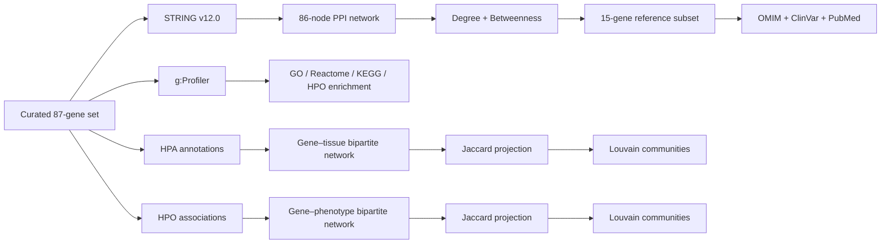

# Human Spliceosome Network Analysis in R

**Systems Biology · Network Bioinformatics · Functional Enrichment · Biomedical Data Integration**


> Portfolio version of the Master's Thesis **“Organización funcional y relevancia biomédica de los genes del espliceosoma humano: un enfoque de Biología de Sistemas”**, graded **9.6/10**.

This repository documents and preserves the computational work behind the thesis as a technical portfolio project. The study combines curated spliceosome gene sets, protein–protein interaction analysis, network topology, functional enrichment, tissue-expression associations, human phenotype associations and clinical evidence.

> **Start here:** [START_HERE.md](START_HERE.md) · [Results gallery](docs/portfolio/RESULTS_GALLERY.md) · [Methods](docs/portfolio/METHODS.md) · [Results by analysis](docs/portfolio/RESULTS_BY_ANALYSIS.md)

> **Data provenance:** numerical values, genes, thresholds and reported findings are taken from the supplied thesis/project material. No new biological result has been added to the portfolio presentation.

## Executive summary

The project starts from a manually curated set of **87 human spliceosome-related protein-coding genes**, classified into **39 structural-core genes, 20 auxiliary factors and 28 regulatory factors**.

The PPI network was generated in **STRING v12.0** for *Homo sapiens* using a combined confidence threshold of **≥ 0.700** and a zero-order network. `ISL1` remained in the complete gene set but had no interaction with the rest of the set at that threshold, leaving **86 connected genes** for the topological analysis.

The resulting PPI network contained **1,832 edges**, a mean interaction score of **0.784**, and a STRING PPI-enrichment result of **p < 1 × 10⁻¹⁶**, compared with 96 expected interactions for a random set of the same size.

The analysis then integrated functional enrichment, HPA tissue associations, HPO phenotype associations and clinical evidence from OMIM, ClinVar and PubMed. `SF3A2` had the highest PPI degree (**69**), whereas `SRSF1` had the highest PPI betweenness (**268.84**).

## Technical profile

| Area | Demonstrated work |
|---|---|
| Programming | **R** · data wrangling · automated result export · figure generation |
| Network biology | **PPI networks · bipartite networks · Jaccard projections · Louvain communities** |
| Graph metrics | **Degree · betweenness · closeness · eigenvector centrality · B/D ratio** |
| Functional genomics | **g:Profiler · GO · Reactome · KEGG · HPO** |
| Biomedical data | **HPA · HPO · OMIM · ClinVar · PubMed** |
| Data integration | **Gene-symbol / Entrez mapping · heterogeneous biological annotations** |

## Results at a glance

| Analysis | Result |
|---|---|
| Curated spliceosome set | **87 genes** |
| Functional classification | **39 core · 20 auxiliary · 28 regulatory** |
| Connected PPI network | **86 nodes · 1,832 edges** |
| Mean STRING interaction score | **0.784** |
| STRING PPI enrichment | **p < 1 × 10⁻¹⁶** |
| Highest PPI degree | **SF3A2 — 69** |
| Highest PPI betweenness | **SRSF1 — 268.84** |
| Topological reference subset | **15 genes** |
| HPA global bipartite network | **76 genes · 346 tissues · 12,527 connections** |
| HPO global bipartite network | **27 genes · 516 phenotypes · 836 connections** |
| HPO Louvain communities | **14** |
| Jaccard threshold | **J ≥ 0.20 groups · J ≥ 0.25 global** |

## Visual results

The visual outputs are deliberately placed before the detailed methodology: the repository is designed to work as a **portfolio as well as an academic archive**.

### Global PPI network


STRING v12.0 network from the 87-gene input set. The thesis reports 86 connected nodes and 1,832 edges; `ISL1` remained isolated at the ≥0.700 confidence threshold. Independently confirmed by STRING's own Network Stats panel:


### Global HPA tissue-similarity network


The global HPA analysis produced **12,527 gene–tissue bipartite connections between 76 genes and 346 tissues**. The global similarity projection used **J ≥ 0.25** and Louvain community detection.

### Global HPO phenotype-similarity network


The global HPO analysis comprised **27 mapped genes, 516 phenotypes and 836 bipartite connections**, followed by Jaccard projection at **J ≥ 0.25** and Louvain community detection, yielding **14 communities**.

**More figures:** [Results gallery →](docs/portfolio/RESULTS_GALLERY.md)

## Why this project is relevant to dry-lab roles

This project demonstrates the ability to move from a biological question to structured computational analysis, integrate heterogeneous biomedical resources, quantify network structure, generate interpretable visual outputs and document the boundary between automated analysis and external-platform results.

It is representative of work in **network biology, systems biology, computational biomedicine and data-driven target/disease research**.

## Biological question

The thesis asks whether the human spliceosome can be characterized as an interconnected biological system in which genes occupy distinguishable topological, functional, tissue and clinical positions.

The computational strategy integrates multiple views of the same gene set:

1. **Network topology:** which nodes are highly connected and which act as intermediaries?
2. **Functional organization:** which biological processes, cellular components and pathways are enriched?
3. **Tissue context:** where are the genes associated with the most connected HPA terms?
4. **Phenotypic context:** which human phenotypes are shared across genes?
5. **Clinical evidence:** which highly central genes have documented disease associations?

## Computational workflow



## Dataset and curation

The final study set contains **87 protein-coding genes** manually classified into:

- **Structural core:** 39 genes.
- **Auxiliary factors:** 20 genes.
- **Regulatory factors:** 28 genes.

The thesis describes inclusion and exclusion criteria based on spliceosome participation, predominantly nuclear localisation, evidence of a direct splicing-related role and representation in at least two consulted databases.

The complete reference dataset is available in `data/reference/`.

## Network topology

The PPI network was created in **STRING v12.0** with *Homo sapiens*, combined confidence **≥ 0.700**, and a zero-order network restricted to the supplied protein set.

Network topology was evaluated as an undirected network using **degree centrality** and **betweenness centrality**. A **B/D ratio** was also calculated as a complementary measure of relative intermediation.

`SF3A2` ranked first in degree with **69**. `SRSF1` ranked first in betweenness with **268.84**. A 15-gene reference subset was selected by combining centrality with functional diversity.

## Functional enrichment

The enrichment analysis used **g:Profiler**, *Homo sapiens* as organism, and GO, Reactome, KEGG and HPO resources. Statistical significance was evaluated using the platform's **g:SCS multiple-testing correction**, with adjusted **p < 0.05** as the significance threshold.

At the global level, the reported leading biological-process terms include RNA splicing, mRNA splicing via the spliceosome, mRNA processing and RNA processing.

## HPA tissue analysis

HPA terms exported through g:Profiler were transformed from the `intersections` field into a long-format structure and used to construct gene–tissue bipartite networks and Jaccard similarity projections.

The global network contained **76 genes, 346 tissues and 12,527 bipartite connections**. The highest reported gene degrees were `HNRNPK` and `HNRNPM` (305 each), `SRSF3` (298), `HNRNPA2B1` (285), `HNRNPU` (284) and `SNRNP70` (283).

## HPO phenotype analysis

The complete supplied HPO `genes_to_phenotype.txt` association resource was integrated after mapping gene symbols to NCBI Entrez identifiers with `org.Hs.eg.db`.

The global HPO network contained **27 mapped genes, 516 phenotypes and 836 bipartite connections**, with **14 Louvain communities** after Jaccard projection.

The highest reported gene degrees were `SF3B4` (82), `HNRNPK` (70), `HNRNPH1` (59), `SF3B2` (54) and `CRNKL1` (53).

## Clinical association analysis

For the 15 genes selected as the topological reference subset, the thesis integrated evidence from **OMIM, ClinVar and PubMed**. Evidence was grouped into hereditary disease, cancer-related evidence, indirect functional evidence and no clear pathogenic association.

## Repository structure

```text
spliceosome-network-analysis-R/
├── README.md
├── START_HERE.md
├── CITATION.cff
├── NOTICE.md
├── data/
│   ├── reference/
│   ├── gprofiler/
│   ├── networkanalyst/
│   └── hpo/
├── scripts/
│   ├── analysis/
│   └── data/
├── results/
│   ├── HPA/
│   └── HPO/
├── figures/
│   ├── PPI/
│   ├── HPA/
│   └── HPO/
└── docs/
    ├── portfolio/
    └── tfm/
```

## Reproducibility

The main R workflow is `scripts/analysis/network_analysis.R`.

```bash
Rscript scripts/analysis/network_analysis.R
```

The supplied R workflow performs the HPA/HPO analysis pipeline, including identifier mapping, bipartite network construction, centrality calculations, Jaccard projections, Louvain communities, Excel result generation and figures.

The original STRING acquisition and NetworkAnalyst calculations are preserved as documented parts of the academic project. The supplied R script does **not** recreate the original STRING interaction retrieval through an API or rerun the NetworkAnalyst web calculation. The repository therefore distinguishes between source/external-platform outputs, R-based processing and final interpretation.

See [REPRODUCIBILITY.md](docs/portfolio/REPRODUCIBILITY.md) for the detailed boundary.

## Documentation

| File | Purpose |
|---|---|
| [START_HERE.md](START_HERE.md) | Fast route through the repository |
| [RESULTS_GALLERY.md](docs/portfolio/RESULTS_GALLERY.md) | Main visual outputs |
| [RESULTS_SUMMARY.md](docs/portfolio/RESULTS_SUMMARY.md) | Compact quantitative summary |
| [RESULTS_BY_ANALYSIS.md](docs/portfolio/RESULTS_BY_ANALYSIS.md) | Results organised by analytical branch |
| [METHODS.md](docs/portfolio/METHODS.md) | Compact technical methods |
| [PROJECT_OVERVIEW.md](docs/portfolio/PROJECT_OVERVIEW.md) | Project context and study design |
| [REPRODUCIBILITY.md](docs/portfolio/REPRODUCIBILITY.md) | Inputs, thresholds and reproducibility boundaries |
| [REPOSITORY_PLAN.md](docs/portfolio/REPOSITORY_PLAN.md) | Architecture and maintenance logic |
| [network_analysis.R](scripts/analysis/network_analysis.R) | Main R workflow |
| [TFM.pdf](docs/tfm/TFM.pdf) | Complete Master's Thesis |

## Interpretation boundaries

Network centrality describes **topological position**, not biological causality. The thesis discusses database bias, dependence on the initial gene-selection criteria, the static representation of a dynamic spliceosome and the absence of experimental validation.

Disease or phenotype association should therefore not be read as proof that a gene is causally responsible for a pathology.

## Academic provenance

**Student:** Antonio José Bailén de la Cruz  
**Programme:** Master's in Biotechnology and Biomedicine  
**Department:** Biología Experimental  
**Date:** 02/07/2026

See [NOTICE.md](NOTICE.md) for provenance and reuse information.
