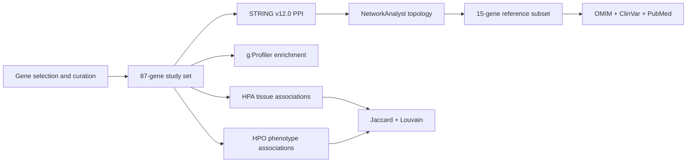

# Project overview

**Title:** Organización funcional y relevancia biomédica de los genes del espliceosoma humano: un enfoque de Biología de Sistemas

**Academic context:** Master's Thesis, Master's in Biotechnology and Biomedicine, dated 02/07/2026.

## Research question

The project analyses the human spliceosome from complementary topological, functional, tissue-expression and clinical dimensions using a Systems Biology framework.

## Analytical workflow

## Technical stack evidenced by the supplied work

`R`, `STRING v12.0`, `NetworkAnalyst 3.0`, `g:Profiler`, `Human Protein Atlas`, `Human Phenotype Ontology`, `igraph`, `ggplot2`, `ggraph`, `readxl`, `openxlsx`, `dplyr`, `tidyr`, `org.Hs.eg.db` and `AnnotationDbi`.

## Main deliverables in this repository

- Curated reference gene dataset.
- Original HPO and g:Profiler input exports.
- Primary-source NetworkAnalyst topology exports (global network + 4 subnetworks).
- R analysis workflow.
- HPA and HPO result workbooks.
- HPA and HPO figures.
- Final Master's Thesis PDF (signature-free).
