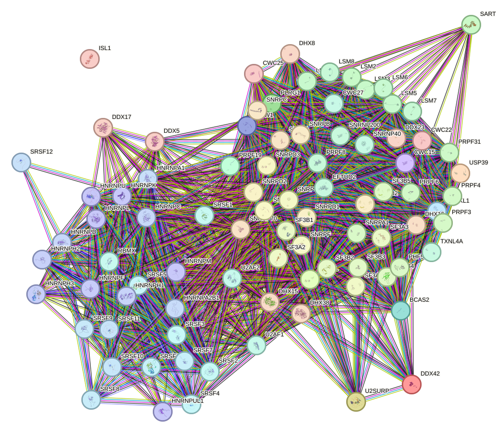
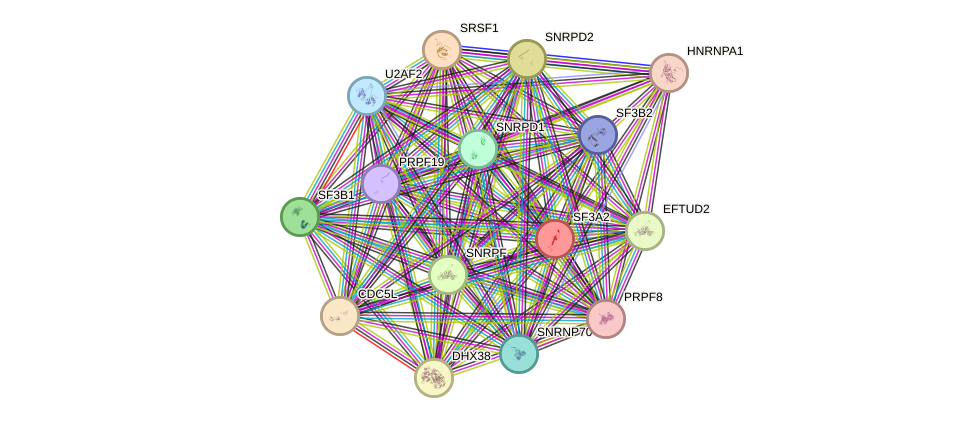
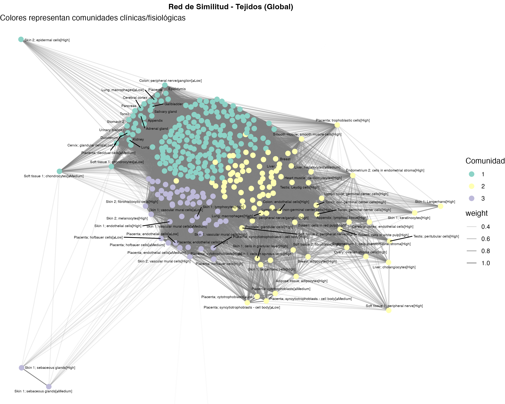
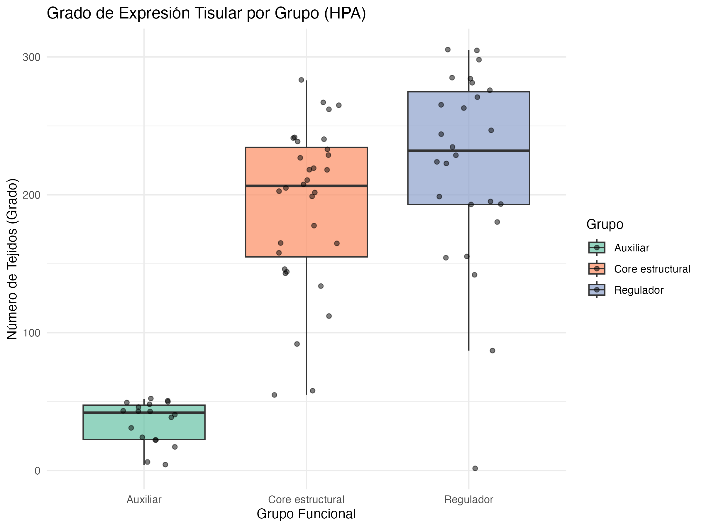
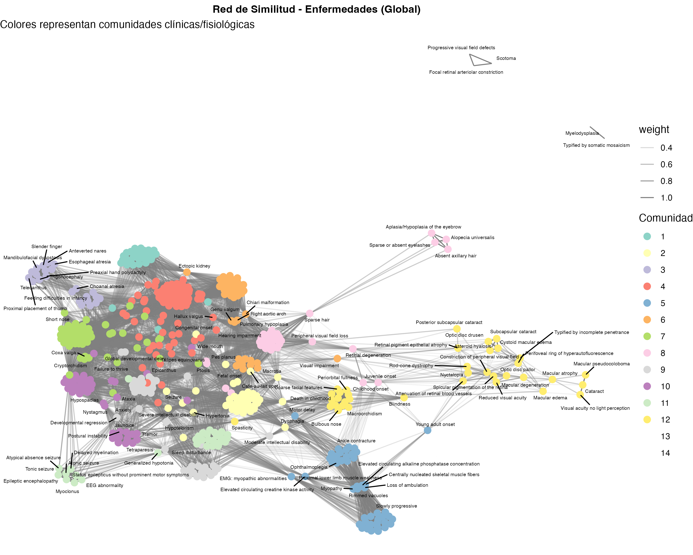
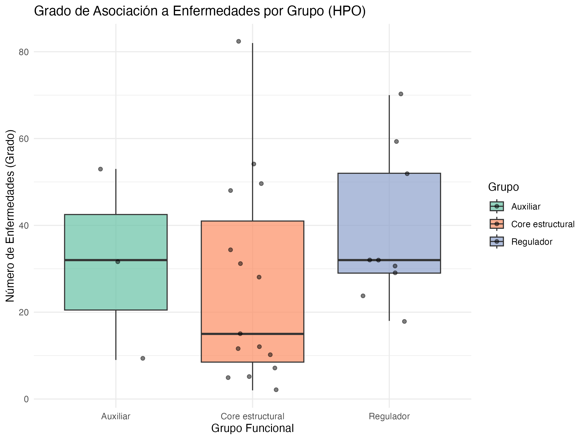

# Results gallery

This page is the visual entry point to the project. The repository preserves the main network figures and quantitative plots from the supplied thesis/project outputs.

## 1. Global PPI network

The thesis reports a STRING v12.0 network built from the 87-gene input set, with 86 connected nodes and 1,832 edges. `ISL1` remained isolated at the ≥0.700 confidence threshold. The dense core (top-right/centre) is dominated by Sm-ring, U2 snRNP and U5/tri-snRNP structural proteins; SR and hnRNP regulators sit at the periphery.

*Primary-source confirmation:* STRING's own **Network Stats** panel (below), exported alongside the network, independently reproduces every headline figure — nodes, edges, expected edges, PPI-enrichment p-value and average degree — and additionally reports the network's average local clustering coefficient.

## 2. PPI topology: reference subset

The thesis selected a 15-gene reference subset by combining high degree/betweenness with functional diversity. Generated with NetworkAnalyst 3.0 from the STRING v12.0 global network.

## 3. Global HPA tissue-similarity network

The global HPA analysis generated 12,527 bipartite gene–tissue connections between 76 genes and 346 tissues. The global similarity projection used J ≥ 0.25 and Louvain community detection, resolving **3** clinically/physiologically coherent tissue communities.

## 4. HPA centrality comparison

The HPA analysis was performed independently for core, auxiliary and regulatory genes before constructing the global network.

## 5. Global HPO phenotype-similarity network

The global HPO analysis comprised 27 mapped genes, 516 phenotypes and 836 bipartite connections, with **14** Louvain communities after Jaccard projection — visibly coherent clusters emerge for retinal/ophthalmological phenotypes, skeletal dysplasia, neurodevelopmental/seizure phenotypes and myopathy, consistent with the disease associations catalogued for the 15-gene reference subset (§7).

## 6. HPO centrality comparison

The project compared phenotype-network architecture across the three functional groups and the global network. The reported totals were 15 mapped core genes, 3 mapped auxiliary genes and 9 mapped regulatory genes.

## 7. Selected quantitative findings

### PPI hubs

`SF3A2` had the highest degree in the PPI network (**69**), while `SRSF1` had the highest betweenness (**268.84**).

### HPA hubs

The global HPA network reported `HNRNPK` and `HNRNPM` at degree 305, followed by `SRSF3` at 298 and `SNRNP70` at 283.

### HPO hubs

The global HPO network reported `SF3B4` at degree 82, `HNRNPK` at 70, `HNRNPH1` at 59, `SF3B2` at 54 and `CRNKL1` at 53.

## 8. Additional figures

A few supplementary, real (not re-generated) figures are included for completeness beyond the six headline images above:

| Figure | What it shows |
|---|---|
| [`figures/PPI/network_global_networkanalyst_heatmap.png`](../../figures/PPI/network_global_networkanalyst_heatmap.png) | The same global network rendered in NetworkAnalyst 3.0, nodes coloured by degree (red = highest: `SRSF1`, `SF3A2`, `SNRPD1`) — a useful cross-check against the STRING layout above |
| [`figures/PPI/functional_subnetwork_core.png`](../../figures/PPI/functional_subnetwork_core.png) | STRING subnetwork of the 39 *core estructural* genes in isolation (713 edges, avg. degree 36.6, clustering 0.984) |
| [`figures/PPI/functional_subnetwork_regulatory.png`](../../figures/PPI/functional_subnetwork_regulatory.png) | STRING subnetwork of the 28 regulatory genes in isolation (279 edges, avg. degree 19.9, clustering 0.861) |
| [`figures/PPI/functional_subnetwork_auxiliary.svg`](../../figures/PPI/functional_subnetwork_auxiliary.svg) | STRING subnetwork of the 20 auxiliary genes in isolation (97 edges, avg. degree 9.7, clustering 0.763) — vector SVG |
| [`figures/HPA/top_hubs_genes.png`](../../figures/HPA/top_hubs_genes.png) / [`figures/HPO/top_hubs_genes.png`](../../figures/HPO/top_hubs_genes.png) | Top gene-side hubs by bipartite degree, coloured by functional group |
| [`figures/HPA/top_hubs_tejidos.png`](../../figures/HPA/top_hubs_tejidos.png) / [`figures/HPO/top_hubs_fenotipos.png`](../../figures/HPO/top_hubs_fenotipos.png) | Top tissue / phenotype nodes by bipartite degree |

## How to read the figures

The figures are complementary rather than interchangeable:

- **PPI network:** protein interaction topology from STRING.
- **HPA network:** similarity among tissues based on shared gene associations.
- **HPO network:** similarity among phenotypes based on shared gene associations.
- **Centrality plots:** local network position within each bipartite analysis.

A high degree in one network therefore does not imply a high degree in another network; the nodes and relationships represented are different.
